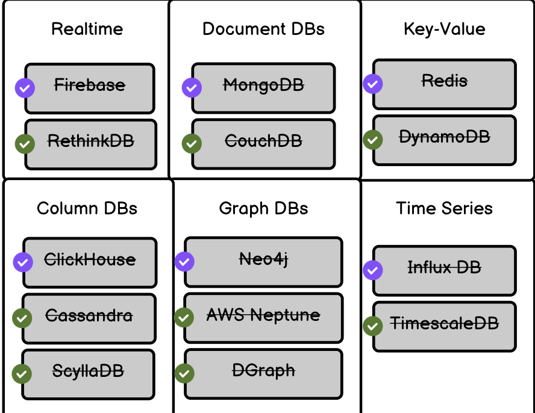

# Budget-Tracker
Developed a Budget Tracker web app to help users monitor savings and expenses with interactive graphs, transaction history, and a savings goal tracker. Data is stored locally for persistence, ensuring a seamless experience.

Key features include:

-Add descriptions to each transaction.
-Maintain a transaction history for easy reference.
-Visualize savings and spending through interactive graphs.
-Set and track a "Savings Goal" with a pie chart representation.
-User-friendly and interactive design.
-Local data storage ensures data persistence even after page refresh.

this is the new part in the readme section
